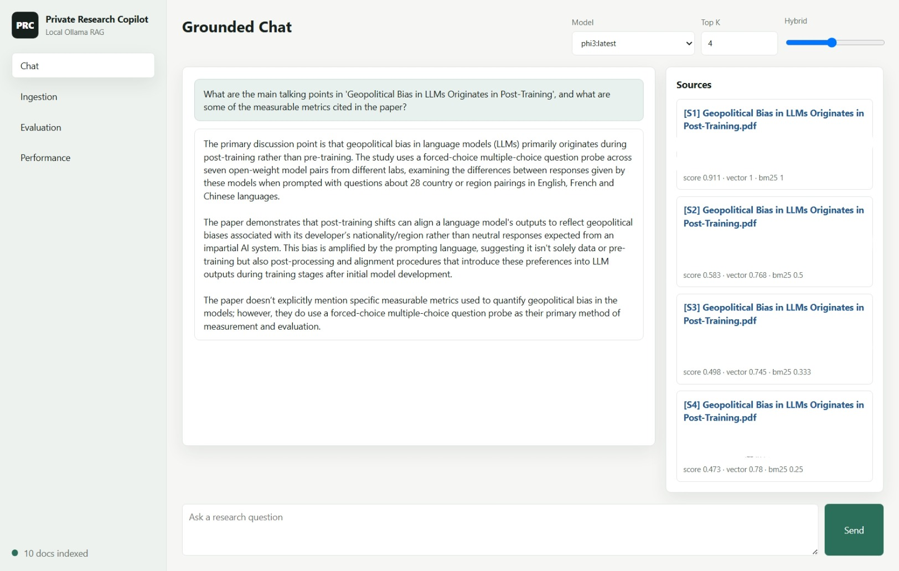

.jpeg)

# Private Research Copilot

Private Research Copilot is a fully local Retrieval-Augmented Generation platform for private document research. It uses Ollama for local models, Qdrant for vector search, SQLite for metadata and BM25, and FastAPI for the API and dashboard.

## What It Includes

- Ollama model switching across Llama 3, Mistral, Gemma, DeepSeek, and Phi.
- PDF, DOCX, TXT, Markdown, and HTML ingestion.
- Recursive, sentence, and token chunking with overlap experiments.
- Qdrant semantic indexing with per-embedding-model collections.
- SQLite FTS5 BM25 hybrid search.
- Query decomposition, reranking, and contextual compression.
- Streaming grounded answers with `[S#]` citations.
- Conversation memory stored locally.
- Evaluation reports for retrieval precision, relevance, hallucination proxy, latency, throughput, and memory.
- Chat, ingestion, evaluation, and performance dashboards.
- Docker Compose deployment with Qdrant and Ollama.

## Quick Start

```powershell
copy .env.example .env
.\scripts\setup.ps1
docker compose up -d qdrant
uvicorn app.main:app --reload --host 127.0.0.1 --port 8000
```

Open `http://127.0.0.1:8000`.

Pull the local Ollama models you want to use:

```powershell
ollama pull llama3
ollama pull mistral
ollama pull gemma
ollama pull deepseek-r1
ollama pull phi3
ollama pull nomic-embed-text
```

## Docker Hub Deployment

From a checkout of this repository, in the repository root:

```powershell
copy .env.example .env
docker compose pull
docker compose up -d
docker compose exec ollama ollama pull llama3
docker compose exec ollama ollama pull nomic-embed-text
```

Compose pulls the published app image and starts it with Qdrant and Ollama. The first model downloads can take several minutes. `llama3` is the default chat model and `nomic-embed-text` is the default embedding model; pull any other chat models listed in `.env` before selecting them in the app.

Open `http://127.0.0.1:8000`. To inspect startup logs, run `docker compose logs -f app`; stop the stack with `docker compose down`. Documents and database files persist under `data/`, while Qdrant vectors and Ollama models persist in named Docker volumes.

## API

- `POST /api/ingest/path`: ingest a local file or directory.
- `POST /api/ingest/upload`: upload and ingest one supported document.
- `POST /api/search`: hybrid semantic and BM25 retrieval.
- `POST /api/chat`: non-streaming grounded answer.
- `POST /api/chat/stream`: server-sent streaming answer.
- `POST /api/evaluation/run`: benchmark retrieval and generation.
- `GET /metrics`: JSON runtime metrics.
- `GET /metrics/prometheus`: Prometheus-style text metrics.

## Architecture

Start with the [repository overview](docs/repo-overview.md) for a project map, or see the [architecture](docs/architecture.md) for the component diagram and extension points.

## Evaluation

Edit [docs/sample_eval_cases.json](docs/sample_eval_cases.json), then run:

```powershell
python scripts/benchmark.py --cases docs/sample_eval_cases.json --out data/exports/report.json
```

## Offline Guarantee

The runtime uses only local services. No OpenAI APIs or cloud inference are used. after Docker images and Ollama model weights are available on the machine, the platform can run without network access...
