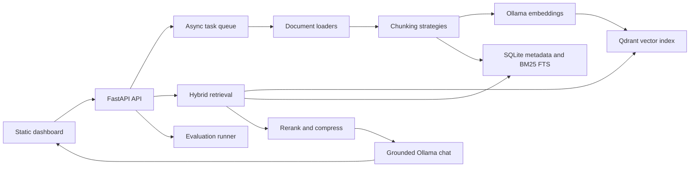

# Architecture

Private Research Copilot is a local-first RAG system built around Ollama, Qdrant, FastAPI, and SQLite.

## Runtime Components

- `app/ingestion`: file discovery, parsing, chunking, embedding, and indexing.
- `app/retrieval`: Qdrant vector search, SQLite FTS5 BM25, score fusion, reranking, query decomposition, and contextual compression.
- `app/generation`: grounded prompt construction, citations, streaming responses, and conversation memory.
- `app/evaluation`: retrieval precision, answer relevance, hallucination proxy, latency, throughput, and report persistence.
- `app/core`: settings, Ollama client, logging, metrics, and retrying task queue.
- `app/static`: local dashboard for chat, ingestion, evaluation, and performance.

## Local Data

- SQLite metadata: `data/research_copilot.db`
- Uploaded files: `data/uploads`
- Benchmark exports: `data/exports`
- Qdrant vectors: Docker volume `qdrant_data`
- Ollama models: local Ollama store or Docker volume `ollama_data`

## Extensibility Points

- Add loaders in `app/ingestion/loaders.py`.
- Add chunking strategies in `app/ingestion/chunking.py`.
- Replace reranking in `app/retrieval/rerank.py` with a local cross-encoder.
- Add new evaluation metrics in `app/evaluation/metrics.py`.
- Swap the in-process queue for Celery/RQ without changing API contracts.

